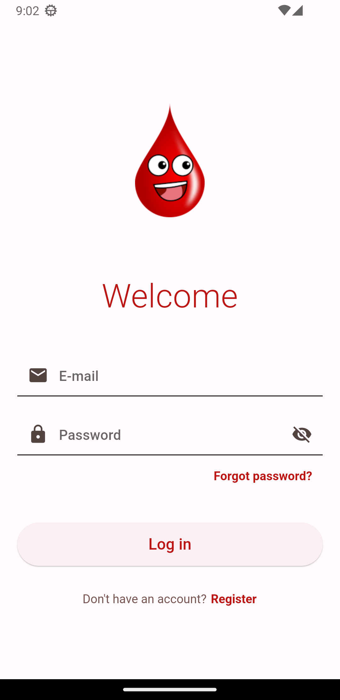
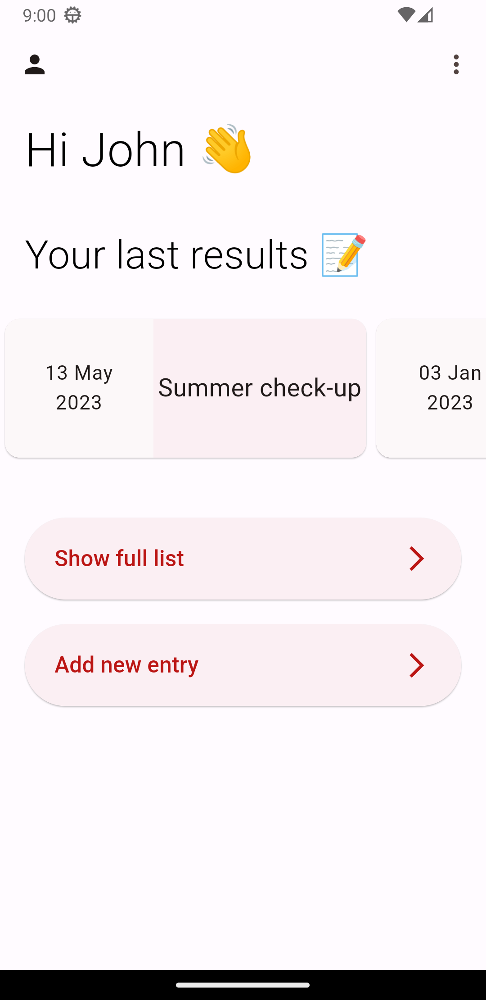
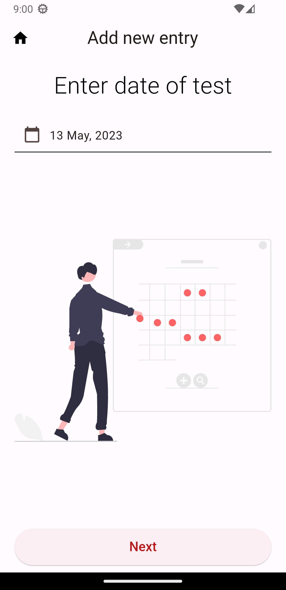
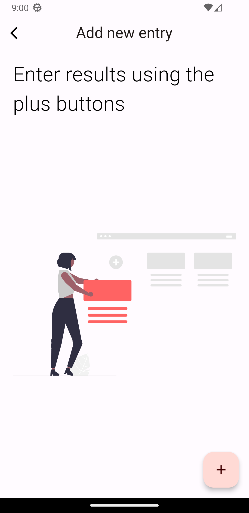
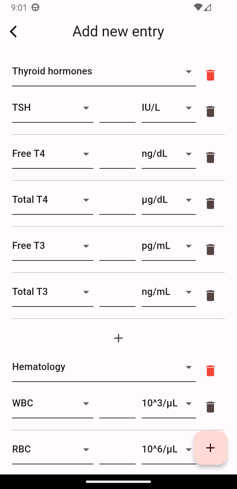
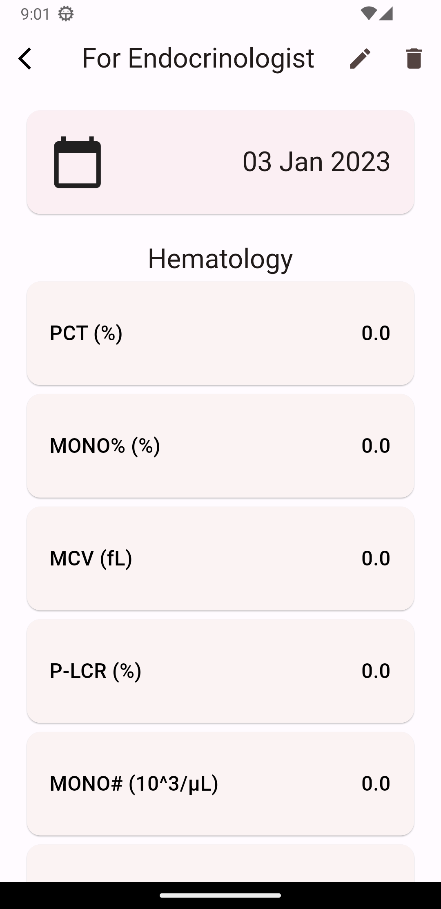

# My Blood - Blood Test Result Management Application

Welcome to **My Blood** - an application for managing blood test results! MyBlood is a Flutter && Firebase based application that follows the principles of Domain-Driven Design (DDD)

## Screenshots
<p float="left">






</p>

## Requirements

Before you can start using **My Blood**, you need to have Flutter installed on your machine.

## Running the Application

Simply clone this repository to your local machine and navigate to the project directory, then run following command in your terminal.

```
flutter run
```

## Data Storage

To ensure that your data is secure and easily accessible, **My Blood** uses Firebase Firestore as its primary data storage solution.
